# Account Audit Lifecycle Visualization

## 1. Flowchart (Account Lifecycle)

```mermaid
flowchart TD
  %% Nodes (map to audit events)
  A1["00:00:00 - Account created<br/>(log_id:10001)"]
  A2["00:00:01 - Initial deposit<br/>(log_id:10002)"]
  A3["00:00:02 - Credit added<br/>(log_id:10003)"]
  A4["00:10:00 - User login (web)<br/>(log_id:10004)"]
  A5["00:11:00 - Market order submitted<br/>(log_id:10005)"]
  A6["00:11:00 - Margin check passed<br/>(log_id:10006)"]
  A7["00:11:00 - Order executed / filled<br/>(log_id:10007)"]
  A8["00:11:00 - Position opened<br/>(log_id:10008)"]
  A9["00:11:00 - Deal created (entry)<br/>(log_id:10009)"]
  A10["00:11:00+ - Periodic tick updates<br/>(log_id:10011 ... 10030)"]
  A11["01:20:00 - Margin call triggered<br/>(log_id:10032)"]
  A12["01:20:01 - Margin call email/websocket<br/>(log_id:10033 / 10034)"]
  A13["01:55:00 - Price deterioration continues<br/>(log_id:10040)"]
  A14["02:20:00 - Stop out triggered (liquidation start)<br/>(log_id:10041)"]
  A15["02:20:00 - Position closed (liquidation)<br/>(log_id:10042 / 10043)"]
  A16["02:20:00 - Balance updated (loss realized)<br/>(log_id:10044)"]
  A17["02:20:01 - Stop out notification sent<br/>(log_id:10047 / 10048)"]
  A18["02:20:02 - Liquidation complete / final state<br/>(log_id:10049 / 10050)"]

  %% Flow
  A1 --> A2 --> A3 --> A4
  A4 --> A5 --> A6 --> A7 --> A8 --> A9 --> A10
  A10 --> A11 --> A12
  A12 --> A13 --> A14 --> A15 --> A16 --> A17 --> A18

  %% Styling (optional)
  class A11,A14,A15,A16,A18 critical;
  classDef critical fill:#ffe6e6,stroke:#cc0000,stroke-width:1.5px;
```

---

## 2. Key Points Summary

| Step                 | Description                    | Time     | Log IDs |
| -------------------- | ------------------------------ | -------- | ------- |
| Account Created      | Initial seeding                | 00:00:00 | 10001   |
| Deposit              | Initial funding                | 00:00:01 | 10002   |
| Credit Added         | Bonus credit                   | 00:00:02 | 10003   |
| Login                | User web login                 | 00:10:00 | 10004   |
| Order Submission     | EURUSD BUY order               | 00:11:00 | 10005   |
| Margin Check         | Margin validated               | 00:11:00 | 10006   |
| Execution            | Order filled                   | 00:11:00 | 10007   |
| Position Opened      | New trade active               | 00:11:00 | 10008   |
| Margin Call          | Warning issued                 | 01:20:00 | 10032   |
| Stop Out             | Liquidation start              | 02:20:00 | 10041   |
| Liquidation Complete | All closed, notifications sent | 02:20:02 | 10049   |

---

